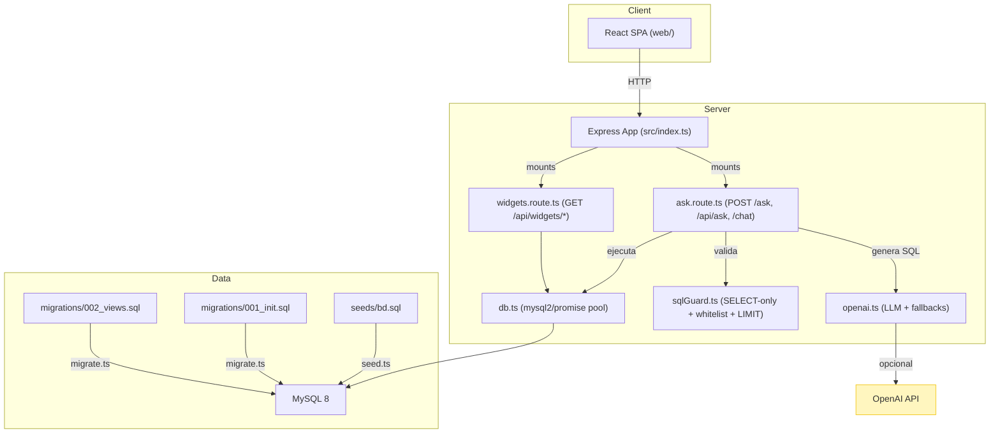
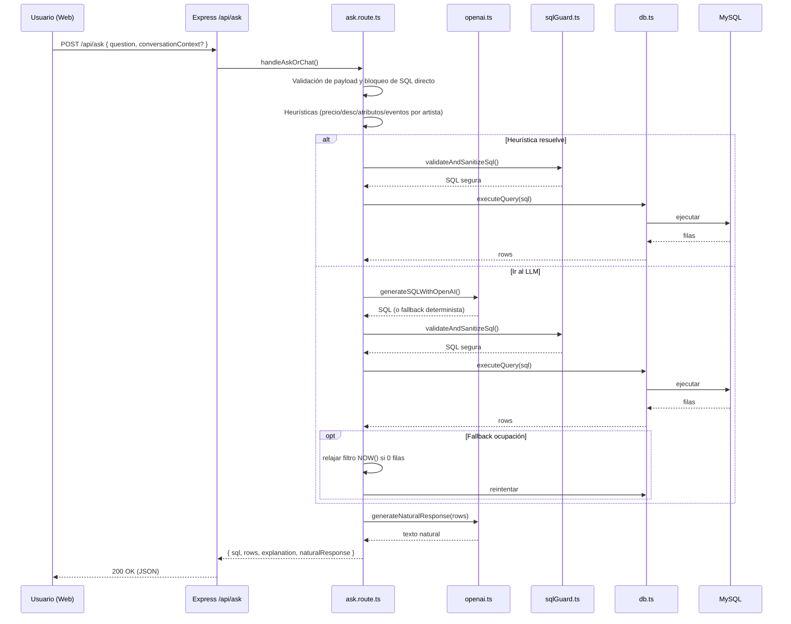
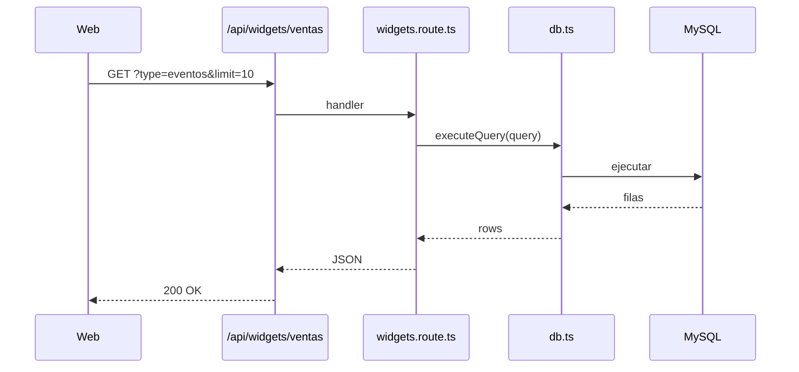
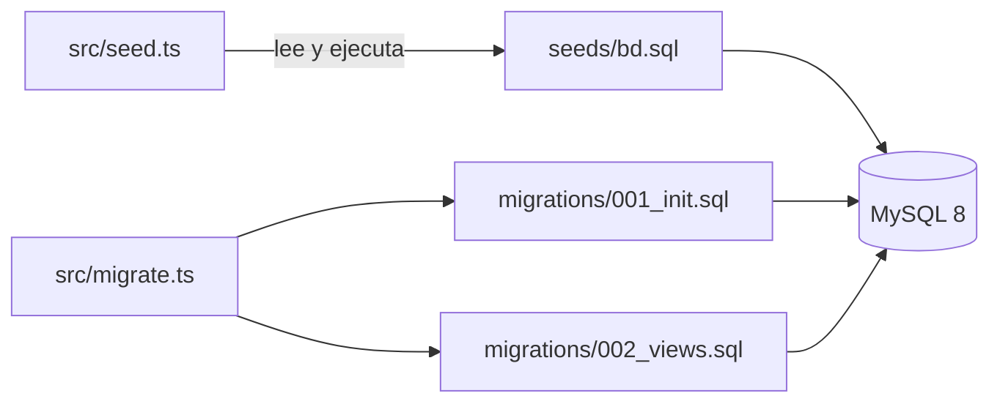

# Arquitectura de la aplicación

Este documento resume el funcionamiento del sistema, el flujo de datos y cómo se conectan las distintas partes del backend y la interfaz web.

## Visión general (componentes)

- web/: frontend React (SPA) que consume la API.
- src/index.ts: arranque y configuración del servidor (seguridad, CORS, rate-limit, logs, SPA estática).
- src/ask.route.ts: NL→SQL (preguntas a SQL válido, ejecución y respuesta natural).
- src/widgets.route.ts: endpoints para gráficos/KPIs del dashboard.
- src/openai.ts: integración con OpenAI (cuando hay API key), inyección dinámica de esquema, fallbacks deterministas y respuesta natural.
- src/sqlGuard.ts: guardarraíles de SQL (solo SELECT, whitelist de tablas/vistas, CTE/HAVING, auto-LIMIT).
- src/db.ts: pool de MySQL y ejecución segura de consultas.
- seeds/ y migrations/: scripts para crear/actualizar estructura y datos.

## Secuencia: una consulta /ask

Puntos clave:
- Small-talk se responde sin SQL.
- Heurísticas aceleran respuestas frecuentes (precio de evento, descripción, atributos, eventos por artista) antes del LLM.
- Guardia SQL aplica siempre antes de tocar la BD.
- Fallback de ocupación: si la consulta de “ocupación” sin “próximos” devuelve 0 por usar NOW(), se relaja el filtro temporal y se reintenta.

## Secuencia: widgets (ej. ventas)

- Otros endpoints similares: `/api/widgets/kpis`, `/api/widgets/valoraciones`, `/api/widgets/top-ciudades`.

## Flujo de datos: seeds y migraciones

- `src/seed.ts`: ejecuta `seeds/bd.sql` (estructura + datos) con usuario root.
- `src/migrate.ts`: ejecuta migraciones ordenadas y crea usuario read-only con permisos SELECT.
- Runtime: la app usa credenciales read-only (configurables por .env).

## Capas y responsabilidades (resumen)

- Presentación: `web/` (React + Vite) consume la API y visualiza tablas, KPIs y gráficos.
- API/Controladores: `src/index.ts`, `src/ask.route.ts`, `src/widgets.route.ts`.
- LLM y respuestas: `src/openai.ts` (prompts, fallbacks, natural responses, esquema dinámico).
- Seguridad SQL: `src/sqlGuard.ts` (SELECT-only, whitelist, CTE/HAVING, auto-LIMIT, limpieza de comentarios).
- Datos/Acceso: `src/db.ts` (pool, ejecución con logs), `seeds/`, `migrations/`.

## Modos de operación y banderas

- Test (`NODE_ENV=test` o `VITEST=true`):
  - No se inicializa OpenAI; se usan fallbacks deterministas.
  - `index.ts` no sirve la SPA.
  - `ask.route.ts` devuelve filas simuladas para ciertos patrones.
  - Rate-limit reducido y aplicado solo a POST /ask.
- Desarrollo/Producción:
  - OpenAI opcional (si `OPENAI_API_KEY` válida).
  - Inyección dinámica de esquema activada por defecto (`OPENAI_INCLUDE_SCHEMA`, desactivable con false/0/off).
  - Seguridad: helmet, CORS, rate-limit, guardia SQL.

## Extensibilidad

- Nuevos intents NL→SQL: añadir ejemplos al `SYSTEM_PROMPT` y/o lógica en `generateFallbackSQL()` (openai.ts).
- Nuevas vistas/consultas: crear vista en SQL (migrations), incluir en whitelist (`sqlGuard.ts`) y en esquema dinámico (`openai.ts`).
- Nuevos endpoints de dashboard: añadir en `widgets.route.ts` con consultas agregadas y ordenadas.

---
Sugerencia: enlaza este documento desde el README principal para facilitar el descubrimiento por parte de otros desarrolladores.